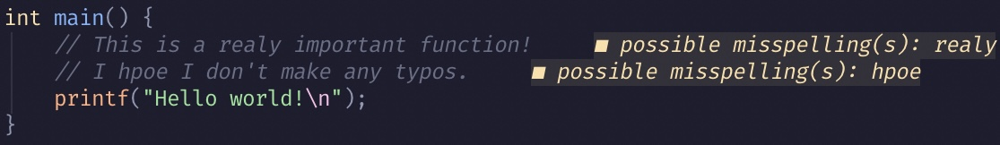

# Spellwarn.nvim



This is a plugin to display spelling errors as diagnostics. Some language servers offer this as a feature, but they have several issues:

- By finding spelling separately from Neovim, they don't respect options like `spellfile` or `spelllang`.
- Their spelling mistakes don't align with Neovim's, which is a source of inconsistency.
- You can't use the default keybindings to add words to your spellfile.
- Neovim spelling works in nearly all filetypes, and is context-aware with Treesitter, whereas language servers like `ltex` only work for specific languages.

A simpler solution, therefore, is to use Neovim's existing spellchecking and diagnostics features. This is done by iterating through the flagged words in a buffer and passing them to `vim.diagnostic.set()`. Neovim is fast enough that this is ~instantaneous for most files. See below for installation and configuration instructions.

## Installation
I recommend using [Lazy.nvim](https://github.com/folke/lazy.nvim):
```lua
{
    "ravibrock/spellwarn.nvim",
    event = "VeryLazy",
    config = true,
}
```
You may also want to add the word "spellwarn" to your Neovim dictionary. This can be done by putting the cursor onto "spellwarn" and hitting `zg`.

## Configuration
Pass any of the following options to `require("spellwarn").setup()`:
```lua
{
    event = { -- event(s) to refresh diagnostics on
        "CursorHold",
        "InsertLeave",
        "TextChanged",
        "TextChangedI",
        "TextChangedP",
        "TextChangedT",
    },
    ft_config = { -- spellcheck method: "cursor", "iter", "treesitter", or boolean
        alpha   = false,
        help    = false,
        lazy    = false,
        lspinfo = false,
        mason   = false,
    },
    ft_default = true, -- whether to enable or disable for all filetypes by default
    max_file_size = nil, -- maximum file size to check in lines (nil for no limit)
    severity = { -- severity for each spelling error type (false to disable diagnostics for that type)
        spellbad   = "WARN",
        spellcap   = "HINT",
        spelllocal = "HINT",
        spellrare  = "INFO",
    },
    prefix = "possible misspelling(s): ", -- prefix for each diagnostic message
}
```
Note that most options are overwritten (e.g. passing `ft_config = { python = false }` will mean that `alpha`, `mason`, etc. are set to true) but that `severity` is merged, so that passing `spellbad = "HINT"` won't cause `spellcap` to be nil. You can pass any of `cursor`, `iter`, `treesitter`, `false`, or `true` as options to `ft_config`. The default method is `cursor`, which iterates through the buffer with `]s`. There is also `iter`, which uses the Lua API, and `treesitter`, which uses the Lua API and Treesitter (and falls back on `iter` if Treesitter is unavailable). Finally, `false` disables Spellwarn for that filetype and `true` uses the default (`cursor`).

## Usage
The plugin should be good to go after installation with the provided snippet. It has sensible defaults. Run `:Spellwarn enable` or `:Spellwarn disable` to enable/disable during runtime (though this will *not* override `max_file_size`, `ft_config`, or `ft_default`). To disable diagnostics on a specific line, add `spellwarn:disable-next-line` to the line immediately above or `spellwarn:disable-line` to a comment at the end of the line. To disable diagnostics in a file, add a comment with `spellwarn:disable` to the *first* line of the file.

## Contributing
PRs and issues welcome!
